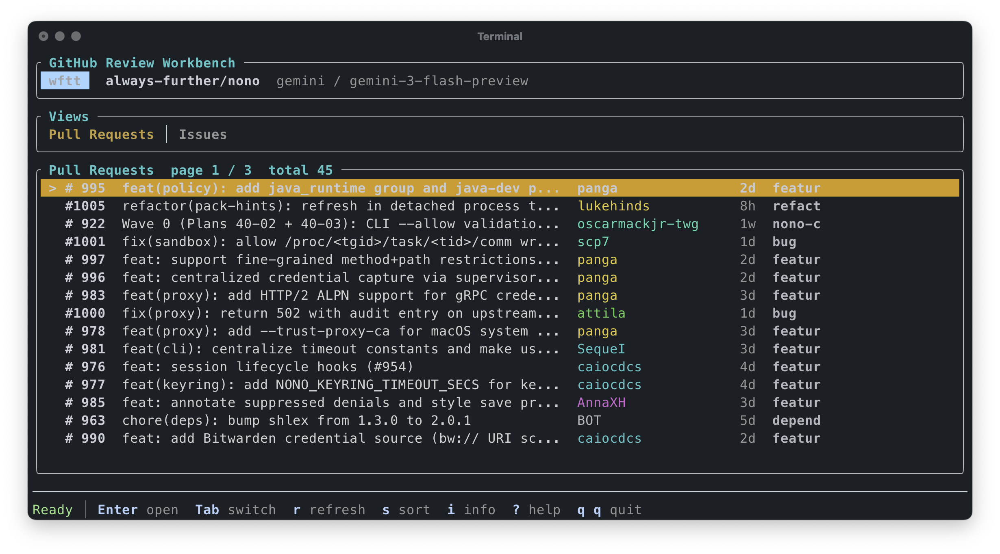

# lgtm

A terminal UI for reviewing GitHub pull requests and issues, with AI-powered analysis.



## Install

```bash
cargo install --path .
```

## Requirements

- `GITHUB_TOKEN` environment variable with repo read access
- An AI provider API key (OpenAI, Gemini, Anthropic, or any OpenAI-compatible endpoint)

## Usage

```bash
lgtm --repo owner/repo
```

Or set defaults in a config file (see below) and just run `lgtm`.

## Keys

| Key | Action |
|-----|--------|
| `Enter` | Open PR / issue detail and run AI analysis |
| `Tab` | Switch between Pull Requests and Issues |
| `Left` / `Right` | Previous / next list page |
| `r` | Refresh from GitHub |
| `s` | Cycle sort mode |
| `f` | Cycle cache filter (all / cached / uncached) |
| `/` | Search current list/detail/diff text |
| `x` | Clear search and filters |
| `o` | Open selected PR / issue in GitHub |
| `d` | View diff (from PR detail) |
| `c` | Copy AI review to clipboard |
| `v` | Copy summary / overview from detail screens |
| `n` / `p` | Next / previous file in diff viewer |
| `]` / `[` | Next / previous hunk in diff viewer |
| `i` | Runtime info |
| `?` | Help |
| `q q` | Quit |

PRs are sorted by reviewability by default — passing CI, small diffs, and recently updated first.

## Config

Create a `lgtm.toml` in your project or home directory:

```toml
[github]
repo = "owner/repo"

[ai]
provider = "gemini"
model = "gemini-2.0-flash"
api_key_env = "GEMINI_API_KEY"

[ui]
columns = ["title", "author", "age", "label"]

[review]
enabled = true
repo_path = "."
system_prompt = """
Focus on repository-specific review concerns here.
"""
# Or load instructions from a file relative to the working directory.
# system_prompt_file = ".lgtm-review.md"
min_tool_calls = 3
max_tool_calls = 8
max_tool_output_bytes = 12000
```

Supported providers: `openai`, `gemini`, `anthropic`, or any OpenAI-compatible endpoint via `base_url`.

PR analysis uses read-only repo-context tools by default when `review.enabled`
is true. The model must request at least `min_tool_calls` bounded tool calls
before producing the final review. Available tools are `read_file`, `list_dir`,
`grep`, `changed_files`, and `diff_for_file`.
When cache is enabled, lgtm prepares a cached detached worktree for the PR head
SHA and points these tools at that exact tree. If worktree preparation fails,
it falls back to `review.repo_path`.
Set `review.system_prompt` in a repo-local `lgtm.toml` to add repository-specific
review instructions. These instructions are additive; lgtm still enforces its
tool and JSON output protocol. You can also set `review.system_prompt_file` to
load those instructions from a file relative to the working directory. If both
are set, lgtm combines them.
Set `max_tool_calls = 0` or `enabled = false` for diff-only analysis.

## CLI flags

```
-r, --repo         GitHub repo (owner/repo)
-p, --provider     AI provider
-m, --model        Model name
    --base-url     Override provider base URL
    --api-key-env  Env var holding the API key
    --config       Path to config file
    --show-config  Print resolved config and exit
```
